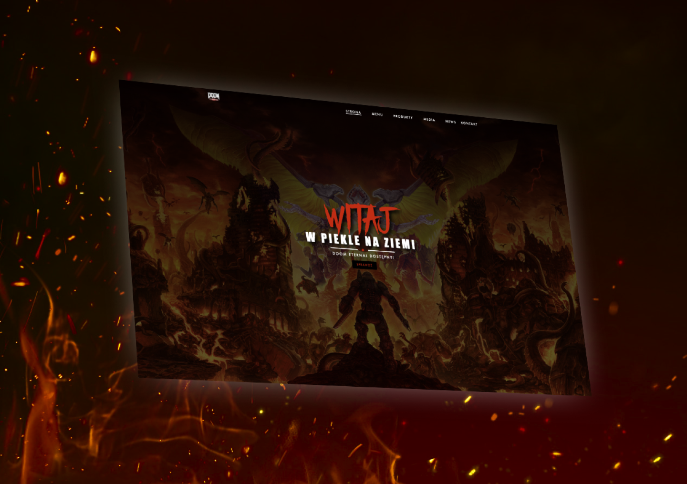

# DOOM Eternal :fire::smiling_imp:

## Description
A visually stunning website created with simple HTML/CSS tools. However, we have added one of the most popular Bootstrap frameworks to our site. What makes our website responsive. This means that this page can be viewed both on the computer :computer: and on the phone :iphone:
###
A bit of Javascript also adds a nice browsing effect to the page :ok_hand:
###
We have a wide website here where we can put any topic. I decided on one of the hottest (literally :fire:) games of the year (in my opinion :stuck_out_tongue_winking_eye:)

## Technologies used
- HTML
- CSS
- Bootstrap
- Javascript

# My Portfolio :smiling_imp:
### [Behance](https://www.behance.net/KarolKomorowski) :computer:

### [Github](https://github.com/FLaMeREVENGE) :paw_prints:

